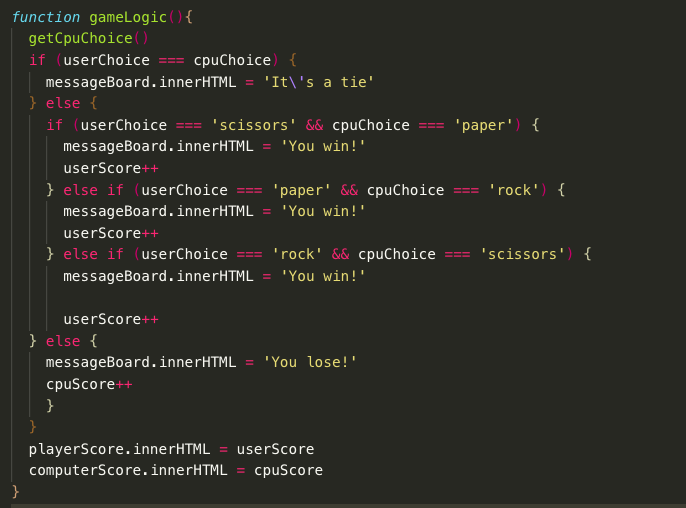
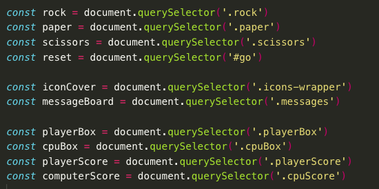
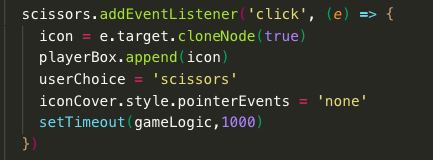
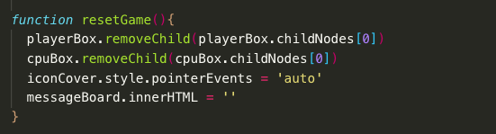

ROCK | PAPER | SCISSORS

I made this during my General Assembly course as a homework, but it was incomplete. I decided to delete the code and have another attempt, with a view to not have it finished, but a bit cleaner on the design front too. 

I challenged myself to do the entire thing from scratch in one sitting, including HTML and stlying. As ever, I used SCSS to style as nesting allows me to write much cleaner code.

<h5>Process</h5>

 I broke my process down into four sections 

<ol>
    <li>Wireframe and HTML</li>
    
 I made sure I knew how my game was going to look by drawing out the game board, and then setting up my HTML document to match that. 
    <li>Suedo code Javascript</li>
    
The next step was to suedo code the games logic. I spent the most time on this section as I wanted to think of all possible bugs and make sure I had them covered. I wrote the game logic and then tested the game plenty through console logs.

    
    <li>Linking up with the DOM</li>
    
Once I knew the game logic was solid, it was then time to link it all up. The previous two steps meant that I knew exactly which elements I needed to grab and what to do with them.

    
    <li>Styling</li>
    
 I enjoy my CSS, and so the final stage was just to make sure the finished project looked nice on the page. I imported a couple of fonts from googlefonts, used fontawesome icons for the rock, paper and scissors, and added a couple of small animations on clickables to add some movement to the page. 

</ol>

<h5>CHALLENGES</h5>

 I wanted my icons to appear in each of the players boxes, but had some trouble doing so. Initially just appending the element to the box meant that it moved the original icon from the bottom of the page. I discovered the 'cloneNode()' method which proved to be exactly what I needed

The same code above also has the 'pointerEvents' style. I love it when you discover a new way to do something. In this instance it was that once you selected your hand, you could continue to click away (flashbacks to classmates trying to break each others games). Initally I was going to removeEventListeners but in order to readd them it was getting a bit clunky. The 'pointerEvents' was brilliant as it just made the div containing the hand icons unclickable, before it was reset in the reset function.

<h5>WINS</h5>

Admittedly this is a very basic game, but I like the result. From nothing to finished product I took just under two hours which is something I'm very happy with 

I tend to get a bit trigger happy wanting to start manipulating the DOM and get things on the page, but by restraining myself and making sure the game logic was sound in the console really made the difference. 

I found that my running a 'reset' function made it possible to simply undo any functions that I'd started. 

